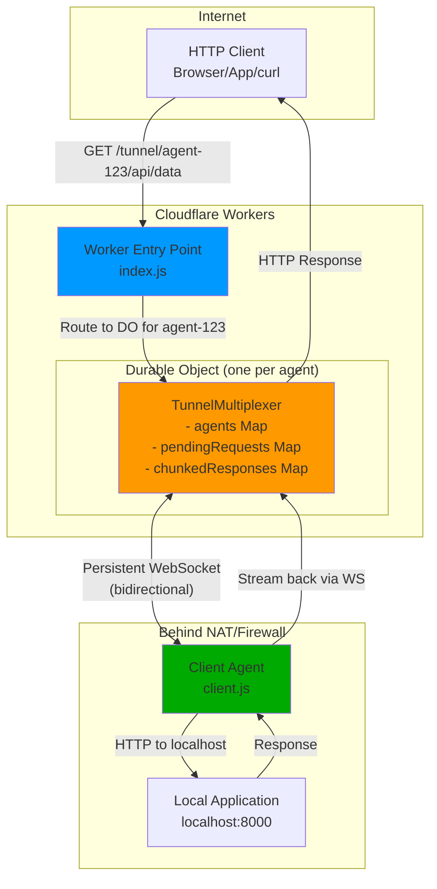
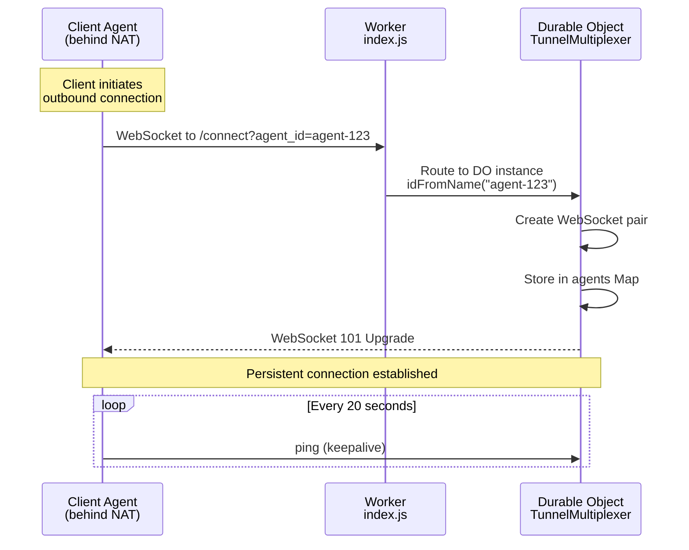
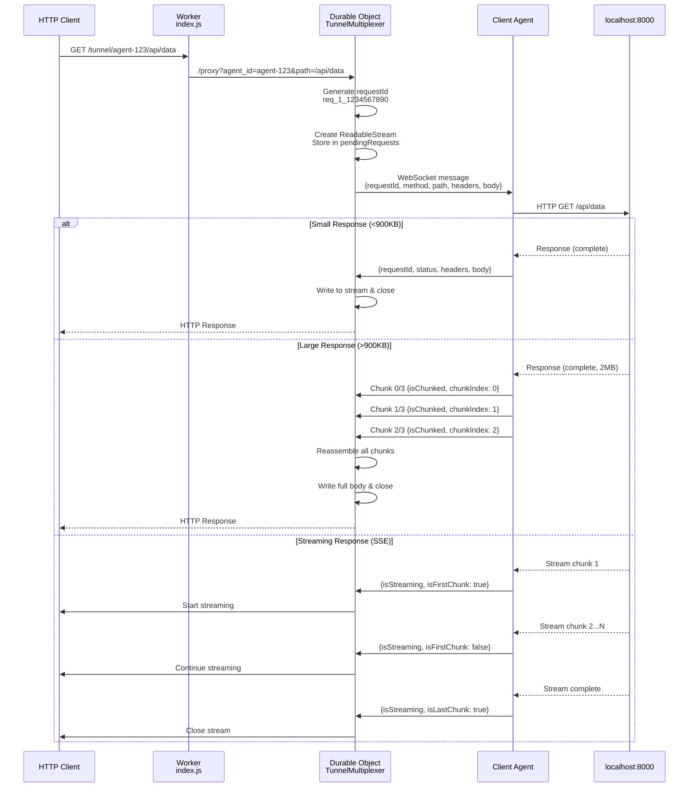

# Architecture

## System Overview



## Connection Flow

### 1. Client Connection (Persistent Tunnel)



### 2. HTTP Request Flow



## Component Responsibilities

```mermaid
graph LR
    subgraph "Worker (index.js)"
        A[Stateless Router]
        A --> B[/connect endpoint]
        A --> C[/tunnel endpoint]
        A --> D[/health endpoint]
    end
    
    subgraph "Durable Object (multiplexer.js)"
        E[Stateful Multiplexer]
        E --> F[Accept WebSocket<br/>from clients]
        E --> G[Store agent<br/>connections]
        E --> H[Route HTTP requests<br/>to agents]
        E --> I[Handle streaming<br/>responses]
        E --> J[Reassemble chunked<br/>responses]
    end
    
    subgraph "Client (client.js)"
        K[NAT Traversal Agent]
        K --> L[Maintain persistent<br/>WebSocket]
        K --> M[Forward requests<br/>to localhost]
        K --> N[Detect response type<br/>Content-Type]
        K --> O[Stream/chunk<br/>responses]
    end
    
    B -.Route.-> F
    C -.Route.-> H
    H -.WebSocket.-> K
```

# Response Handling Architecture

## How It Tells Them Apart

The system distinguishes between three response types automatically:

```
┌─────────────────────────────────────────────────────────────────────┐
│ CLIENT (client.js)                                                   │
│                                                                      │
│  HTTP Response arrives from localhost                               │
│         ↓                                                            │
│  Check Content-Type header                                          │
│         ↓                                                            │
│  ┌──────────────────────────────────────────────────┐              │
│  │ Is it "text/event-stream"?                       │              │
│  └──────────────────────────────────────────────────┘              │
│         ↓                              ↓                             │
│       YES                             NO                             │
│         ↓                              ↓                             │
│  ┌──────────────┐              ┌──────────────┐                    │
│  │ Stream Mode  │              │ Buffer Mode  │                    │
│  └──────────────┘              └──────────────┘                    │
│         ↓                              ↓                             │
│  Send each chunk                Wait for complete                   │
│  immediately with:              response, then check size           │
│    isStreaming: true                   ↓                             │
│    isFirstChunk: bool           ┌──────────────┐                    │
│    isLastChunk: bool            │ Size > 900KB? │                   │
│                                 └──────────────┘                    │
│                                    ↓         ↓                       │
│                                  YES        NO                       │
│                                    ↓         ↓                       │
│                            Split into     Send as                    │
│                            chunks with:   single msg                │
│                            isChunked: true  (no flags)              │
│                            chunkIndex: N                             │
│                            totalChunks: M                            │
└─────────────────────────────────────────────────────────────────────┘
                                  ↓
┌─────────────────────────────────────────────────────────────────────┐
│ MULTIPLEXER (Durable Object)                                        │
│                                                                      │
│  All requests get a ReadableStream                                  │
│         ↓                                                            │
│  Wait 100ms for first message                                       │
│         ↓                                                            │
│  ┌──────────────────────────────────────┐                          │
│  │ Did response complete within 100ms?  │                          │
│  └──────────────────────────────────────┘                          │
│         ↓                    ↓                                       │
│       YES                   NO                                       │
│         ↓                    ↓                                       │
│  Return with             Return with                                │
│  actual headers          SSE headers                                │
│  (buffered response)     (streaming)                                │
│         ↓                    ↓                                       │
│  ┌──────────────────────────────────────┐                          │
│  │ Message arrives from client          │                          │
│  └──────────────────────────────────────┘                          │
│         ↓                                                            │
│  ┌──────────────────────────────────────┐                          │
│  │ Which type?                           │                          │
│  └──────────────────────────────────────┘                          │
│         ↓                ↓              ↓                            │
│   isStreaming?     isChunked?      Neither                          │
│         ↓                ↓              ↓                            │
│  Write to stream   Collect chunks   Write full                      │
│  immediately       in array,        body and                        │
│  chunk by chunk    reassemble       close stream                    │
│                    when complete                                     │
│                    then write full                                   │
│                    body and close                                    │
└─────────────────────────────────────────────────────────────────────┘
                                  ↓
┌─────────────────────────────────────────────────────────────────────┐
│ HTTP CLIENT (Swift, Browser, curl)                                  │
│                                                                      │
│  Receives HTTP Response with ReadableStream body                    │
│         ↓                                                            │
│  ┌──────────────────────────────────────┐                          │
│  │ Is Content-Type: text/event-stream?  │                          │
│  └──────────────────────────────────────┘                          │
│         ↓                    ↓                                       │
│       YES                   NO                                       │
│         ↓                    ↓                                       │
│  Stream events           Wait for complete                          │
│  as they arrive          response body                              │
│  (SSE parser)            (standard HTTP)                            │
│         ↓                    ↓                                       │
│  data: {...}             Full JSON/HTML                             │
│  data: {...}             response                                   │
│  data: {...}                                                         │
└─────────────────────────────────────────────────────────────────────┘
```

## Who Assembles What?

### Client (client.js)
- **Assembles**: Nothing
- **Disassembles**: Large responses (>900KB) into chunks for WebSocket transport
- **Detection**: Uses HTTP response headers (`Content-Type`)

### Multiplexer (Durable Object)
- **Assembles**: Large chunked responses (`isChunked`) back into complete body
- **Streams through**: Real-time streaming responses (`isStreaming`) chunk by chunk
- **Detection**: Uses message flags from client

### HTTP Client (Swift, Browser, etc.)
- **Assembles**: Nothing - just receives standard HTTP responses
- **Streaming**: Handles SSE naturally if `Content-Type: text/event-stream`
- **Buffered**: Receives complete response for normal endpoints

## Seamless Experience

From the **HTTP client's perspective**, it's completely transparent:

```javascript
// Swift code (example)
let url = URL(string: "https://worker.dev/tunnel/agent-id/reply")!
var request = URLRequest(url: url)
request.httpMethod = "POST"
// ... set body, headers ...

// For SSE endpoints:
let source = EventSource(request: request)
source.onmessage = { event in
    print("Got event:", event.data)  // Arrives in real-time! ✨
}

// For regular endpoints:
let (data, response) = try await URLSession.shared.data(for: request)
let json = try JSONDecoder().decode(MyType.self, from: data)
// Works normally, even if response was >900KB ✅
```

The client code doesn't need to know about:
- WebSocket chunking for large responses
- Message reassembly
- Whether the tunnel is being used or direct connection

**It just works!** 🎉

## Summary

**Seamless**: YES ✅
- Client assembles large buffered responses (`isChunked`)
- Client streams real-time responses (`isStreaming`) 
- HTTP clients see standard HTTP responses with correct headers
- No special client-side handling needed

**Detection**: Automatic
- Based on HTTP `Content-Type` header
- Based on response size
- Uses different message flags internally but transparent to end user
