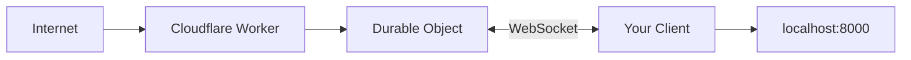

# Local Tunnel Proxy

**Expose localhost through using cloudflare durable objects and edge workers. Super simple. No auth.**


## What is this?

A public https tunnel service running at:
```
https://cloudflare-tunnel-proxy.michael-neale.workers.dev
```
Supports https, sse and more. 

## Why? 

I couldn't find something that could be distributed with random apps that could self service to make tunnels without a signup process or installation/VPN like tools. Also wanted something that could scale and be low cost making use of already scaled platform. Needed predictable re-usable named tunnels which work with https and sse and so on. Also needed to be fast and low latency.

Alternatives: tailscale (nice as very secure, and can do p2p optimally), cloudflared (short term), ngrok... (will flesh this out). Plenty of good ones that may work for you. 

**⚠️ Public Service = Best Efforts**
- This is a shared service, no guarantees
- May hit rate limits with heavy use
- Could go away anytime
- **For serious use: Deploy your own (see below, it is free and easy)**

Anyone can use it. No signup. No tokens. Just pick a random ID and connect.

## Usage

**1. Get the client:**
```bash
git clone <this-repo>
cd lapstone-tunnel
npm install
```

**2. Run it:**
```bash
# Start something on localhost
python -m http.server 8000

# Connect to the tunnel (pick a random ID!)
node client.js \
  https://cloudflare-tunnel-proxy.michael-neale.workers.dev \
  my-laptop-a1b2c3d4e5f6 \
  http://localhost:8000
```

**3. Access it:**
```
https://cloudflare-tunnel-proxy.michael-neale.workers.dev/tunnel/my-laptop-a1b2c3d4e5f6/
```

Done.

## How it works



1. Client opens WebSocket to Worker with agent-id
2. Worker creates a Durable Object for that agent-id
3. HTTP requests to `/tunnel/{agent-id}/path` go through the WebSocket
4. Client proxies to localhost and returns response

**📖 For detailed architecture diagrams, see [ARCHITECTURE.md](./ARCHITECTURE.md)**

## Client API

```bash
node client.js <worker-url> <agent-id> [target]
```

- `worker-url`: The deployed Worker URL
- `agent-id`: Your unique ID (make it random!)
- `target`: Local service (default: `http://127.0.0.1:8000`)

Consider `client.js` as a reference implementation for a client (you can do similar in any language, TODO: need to share my typescript port which has health checking and reconnection built in). It should be fairly simple to clean-room implement this ideally in any environment or language. It is shuttling traffic over a websocket basically.

**Examples:**
```bash
# Basic
node client.js https://worker.dev my-id http://localhost:8000

# Random ID
node client.js https://worker.dev laptop-$(openssl rand -hex 8)

# Different port
node client.js https://worker.dev my-id http://localhost:3000
```

## Deploy your own

**Why deploy your own?**
- 🔒 Keep it private to your team/organization
- 📈 Scale without hitting shared service limits
- 💰 Control your own costs
- ⚡ Guaranteed availability

**How:**

```bash
# First time setup
wrangler login

# Deploy the worker
npx wrangler deploy
```

You'll get output like:
```
Deployed cloudflare-tunnel-proxy triggers
  https://your-worker-name.your-account.workers.dev
```

Now use your own URL instead of the public service. Takes ~30 seconds to deploy!

## Features

- ✅ **Simple HTTP proxying** - Just works like port forwarding
- ✅ **SSE streaming** - Real-time streaming endpoints (like AI chat) work natively
- ✅ **Large response handling** - Automatically chunks responses >900KB
- ✅ **Auto-reconnect** - Client reconnects immediately if disconnected
- ✅ **Durable Objects** - Each agent gets persistent connection

## Files

- `client.js` - Node.js client (~222 lines)
- `src/index.js` - Worker entry point (~110 lines)
- `src/multiplexer.js` - Durable Object (~340 lines)

Total: ~672 lines of code.

## Scalability

Each agent gets its own Durable Object instance, so:

- **Many agents** = Many DOs = Scales horizontally ✅
- **One agent** = One DO = ~1000 requests/second limit per agent
- **Busy agent** won't affect other agents (isolated)
- Free tier: 100k requests/day across all agents

Great for: Personal use, dev tools, demos, small teams
Not great for: High-traffic production apps (single agent bottleneck)

## FAQ

**Q: How much does it cost?**  
A: Free tier: 100k requests/day. Paid plan: $5/month for 10M requests. Same performance either way.

**Q: What if my agent-id collides with someone else's?**  
A: First one wins. That's why you use a random ID.

**Q: Can multiple clients use the same agent-id?**  
A: No. Last one to connect wins.

**Q: How many agents can I run?**  
A: As many as you want - each gets its own DO instance.

## License

MIT

---

**That's it. Keep it simple.**

## The name? 

There is a 100 year old abandoned tunnel near where I live which I am obsessed with (I have only been able to walk through it once, photo is of it, and was dry on a really incredibly rainy month, impressive old engineering).
